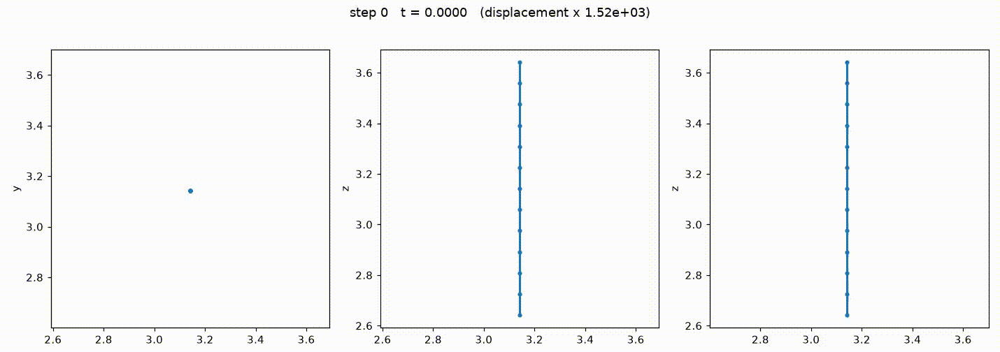
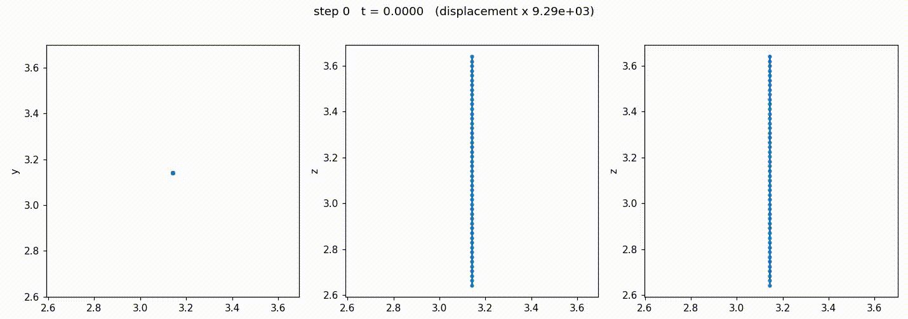

~~~text
███    ███ ██   ██ ██ ████████ ██████   ██████  
████  ████ ██   ██ ██    ██         ██ ██       
██ ████ ██ ███████ ██    ██     █████  ███████  - Fibra
██  ██  ██ ██   ██ ██    ██         ██ ██    ██ 
██      ██ ██   ██ ██    ██    ██████   ██████         
~~~

#### GPU-based Finite difference code for DNS of Multiphase Homogenous isotropic turbulence with a single fibre

Developers:
* A. Roccon (MHIT36 + porting of fiber tracking from FluTAS to MHIT36)
* V. Agrawal (Original implementation of Fiber tracking in FluTAS)

Tested on:
* Milton (1 x RTX5000)
* Leonardo (1 x A100)
* Marge (1 X RTX6000 QMax)

Current capabiltiies:
* DNS of single-phase flow
* Tracking of a stiff fiber using the method of Agrawal et al. 2024, DOI: https://doi.org/10.1016/j.cma.2023.116495
* Extenension to many fibers (planned, TBD)

#### Systems supported:
* Unix + nvfortran 

#### To run a simulation:
* go to src folder and run ./compile_local.sh (if you have one GPU, UNIX system) or ./compile_Leo.sh to run on Leondaro supercomputer.

#### Parallelization strategy
* The code is serial and exploit a single GPU (GPU-resident)

#### Output files.
* Files containing the Eulerian fields (u\_\*\*\*, v\_\*\*\*\*, w\_\*\*\*\*, p\_\*\*\*\* and phi\_\*\*\*\*) and the fibre positions and orientations (fib\_\*\*\*) are stored in src/output

### Structural solver validation
* Free-free bending frequencies vs Euler–Bernoulli theory

Analytical: ω_n = (β_n L)² √(EI / (ρ_f A L⁴)), β_n L = 4.7300, 7.8532, 10.9956 (modes 1–3).
With `align_frame = .false.` (FluTAS frame) bending in the y–z plane uses G·J instead of E·I.

| Case | Mode | `align_frame` | `pert_dir` | `nel` | Stiffness | Freq. analytical | Fr. MHIT36 | Error | FluTAS (reference) | 
|---|---|---|---|---|---|---|---|---|---|---|
| 1  | 1 | `.true.`  | (0,1,0) | 12 | E·I | 20.646  |  20.359  | -1.39%    | 20.189  | 
| 2  | 1 | `.true.`  | (0,1,0) | 24 | E·I | 20.646  |  20.568  | -0.38%    | 20.565  | 
| 3  | 1 | `.true.`  | (0,1,0) | 48 | E·I | 20.646  |  20.635  | -0.05%    | 20.636  | 
| 4  | 2 | `.true.`  | (0,1,0) | 12 | E·I | 56.912  |  57.677  | +1.34%    | 57.677  | 
| 5  | 2 | `.true.`  | (0,1,0) | 24 | E·I | 56.912  |  56.945  | +0.12%    | 56.844  | 
| 6 | 2 | `.true.`  | (0,1,0) | 48 | E·I | 56.912   |  56.699  | -0.37%    | 56.700  | 
| 7 | 3 | `.true.`  | (0,1,0) | 12 | E·I | 111.570  |  83.971  | -24.74%   | 83.971  | 
| 8 | 3 | `.true.`  | (0,1,0) | 24 | E·I | 111.570  | 110.245  | −1.19%    | 110.245 | 
| 9 | 3 | `.true.`  | (0,1,0) | 48 | E·I | 111.570  | 110.430  |  -1.02%   | 110.430 |

